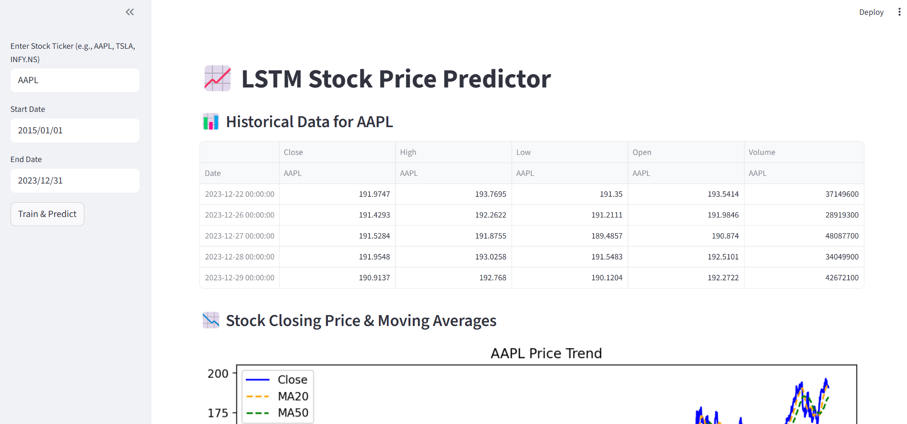
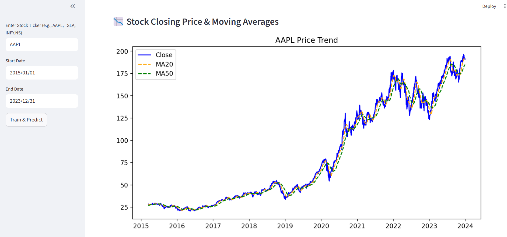
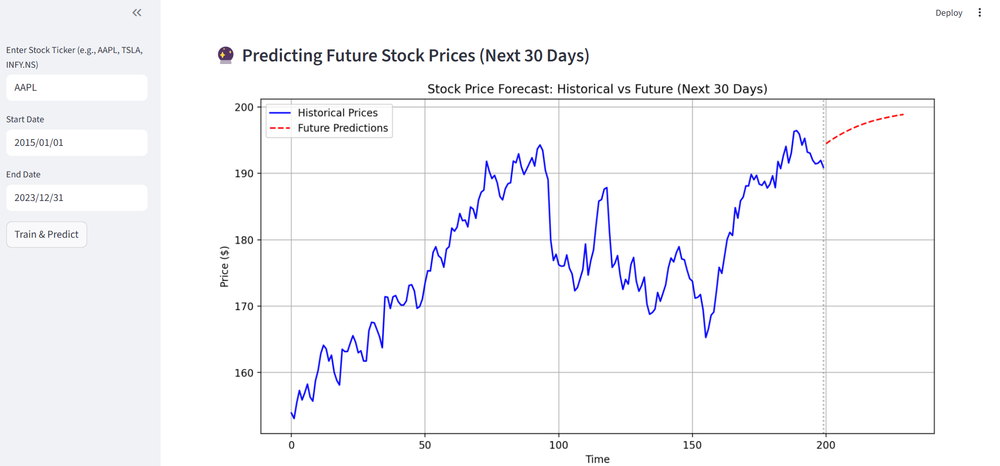
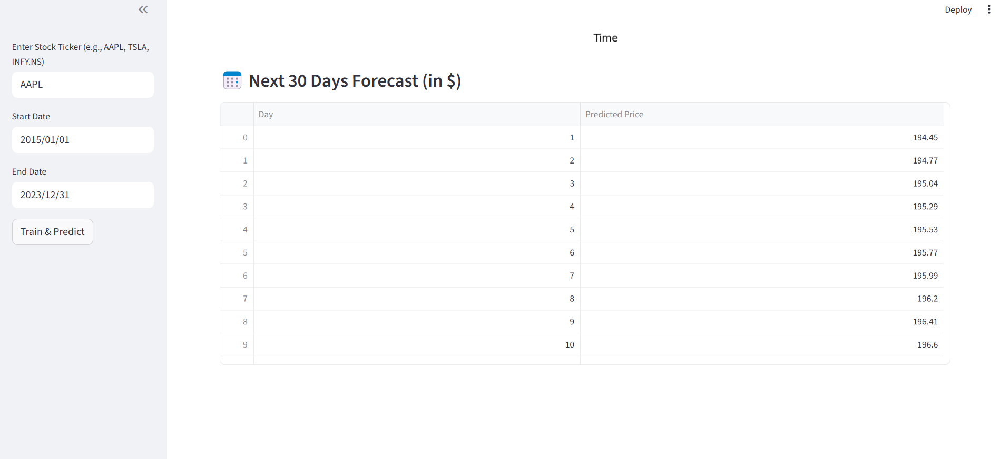

#  Stock Price Prediction 

This project implements a sophisticated Long Short-Term Memory(LSTM) neural network with attention mechanism to predict stock prices with exceptional accuracy. The model incorporates multiple technical indicator to deliver reliable financial forecasts. 

###  Technical Highlights
- Advanced Architecture : Bidirectional LSTM with attention mechanism
- Feature Engineering : 6+ technical indicators(MA20, MA0, Volatility etc)
- Data preprocessing : Robust scaling and sequential data prepration
- Model performance : High accuracy with detailed evaluation metrics
- Visual Analytics : Comprehensive static visualizations for clear insights
- Structured table of 30 day forecast.


###  Run locally
```bash
pip install -r requirements.txt
streamlit run app.py
```

### Key results
- High Accuracy : Model demonstrated strong predictive capabilities
- Practical Application : Real-world financial forecasting implementation

### Technical Improvements
- Incorporate news sentiment analysis and macroeconomic indicators
- Experiment with Transformer architecture for sequence modeling
- Add uncertainity quantification with prediction intervals

### Demo






